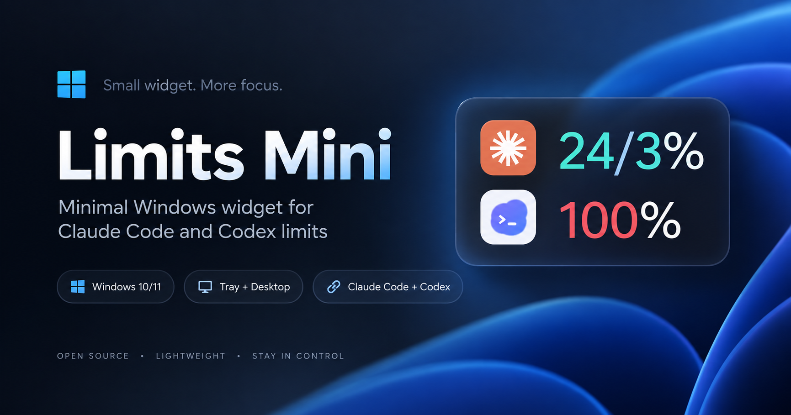
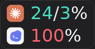

<p align="center">
  
</p>

# Limits Mini

**English** · [Русский](README.ru.md)

**Claude Code and Codex usage limits in a compact Windows widget.**

Two services, two rows, just the numbers you need. Limits Mini displays usage limits on your desktop and in the system tray, so you do not have to keep opening account pages.

<p align="left">
  
</p>

Windows 10/11 x64 · Go + Win32

## Why I built it

I use Claude Code and Codex for development and wanted to keep their limits in view. Not another dashboard or a large panel covering my workspace, just a small widget with a service icon, current usage and a weekly limit.

A compact macOS app provided the visual reference. The Windows tools I looked at did not offer the combination of appearance and simplicity I wanted, so I decided to build my own.

The project was developed with AI assistance and tested on my Windows computer. After the first build, I refined the icons, removed excess width, improved the styling and worked through account connectivity. Rendering percentages was not the hardest part. Getting the data right was: an open Claude Desktop session was not enough for this integration, and the CLI needed an explicit HTTP proxy in my network setup.

The result is a small everyday utility, rather than another interface to manage.

## Features

- Claude Code and Codex in one compact desktop widget, with separate numeric tray icons.
- Available quota windows, reset times and connection status.
- A switch between used percentage and remaining allowance.
- Dragging, saved position, scaling and an optional always-on-top mode.
- Tray-only operation, periodic refresh and optional launch at Windows sign-in.

The default refresh interval is 5 minutes. The menu offers 1, 3, 5 and 10 minutes, plus manual refresh.

This is a standalone Windows application with a compact window, not an extension for the Windows Widgets board. **The app UI in version 0.2.0 is in Russian.** English and Russian documentation are provided here.

## Reading the numbers

```text
Claude   24 / 3%
Codex      100%
```

With the default settings, `24 / 3%` means 24% of Claude's current five-hour window and 3% of its weekly allowance have been used.

Codex displays the main available quota window. When the service returns only a weekly window, the number refers to that weekly limit. `100%` used means `0%` remaining. Open the details to check the window type and reset time.

These are example values, not the numbers you should expect after installation. Available limits depend on the service response. `--` means no current value is available, not zero usage.

## Installation

1. Download the Limits Mini build ZIP from this repository's **Releases** section, not the **Source code** archive.
2. Extract the entire archive and run `Установить.cmd`, the install script.
3. Dismiss the installation message. The app starts, with shortcuts on the desktop and in the Start menu.

The utility itself does not need administrator privileges or a separate Go, Python, Node.js or .NET installation. Claude Code and Codex clients are connected separately.

You can also run `LimitsMini.exe` directly from the extracted folder without installing it. Settings still live in your Windows user profile, not beside the EXE.

Launch at sign-in is off by default and can be enabled from the widget's right-click menu. To update, install the new build from its archive. To uninstall, use **Start → Limits Mini → Uninstall Limits Mini**.

## Connecting accounts

**Claude:** the current implementation needs a subscription sign-in through Claude Code CLI installed natively on Windows. Signing in only through Claude Desktop or a browser is not sufficient. The utility reads CLI authentication and does not extract Desktop cookies.

[Step-by-step Claude setup](docs/claude-setup.md), including CLI installation, sign-in and optional proxy configuration.

**Codex:** install Codex and sign in with your ChatGPT account. Limits Mini searches for a local `codex.exe` and requests limits through `codex app-server`. If automatic discovery fails, use **right-click → Подключение → Codex: выбрать codex.exe** and select the executable from your installed Codex client, not an untrusted EXE downloaded separately.

## Controls

Left-drag the widget to move it. Right-click to open settings and connection options. Double-click the widget for detailed limits and reset times; a single click on a tray icon opens a compact popup.

The installation directory is `%LOCALAPPDATA%\LimitsMini`. Preferences are stored in `%LOCALAPPDATA%\LimitsMini\data\settings.json`.

## Implementation and privacy

The current build uses **Go + Win32**, without Electron or third-party Go modules. It ships as a Windows executable, not a web application.

For Claude, the utility reads the local Claude Code OAuth token and calls Anthropic's usage endpoint. The primary Codex integration uses the local app-server and `account/rateLimits/read`. If that path is unavailable, a fallback uses the token from the local `auth.json` file to call ChatGPT's usage endpoint.

Limits Mini has no project-operated backend, telemetry or automatic update downloads. It does not store tokens in its preferences, read browser cookies or rewrite authentication files. The official Codex client it starts can manage its own authentication.

This does not mean the app has no access to sensitive data: it uses account credentials for authenticated requests. Do not publish `.credentials.json`, `auth.json`, OAuth tokens or screenshots containing them.

## Limitations

This is an early release tested on an individual Windows setup, not a guarantee of compatibility with every account and network. The build is not publisher-signed. Verify the file's origin rather than disabling Windows protection.

Limits Mini does not increase or bypass usage limits. It displays the data available from each service through periodic refresh, not a real-time feed. The Claude integration and Codex fallback depend on service endpoints whose format or availability may change.

The utility does not refresh Claude OAuth tokens itself. When a token expires, you may need to open Claude Code or sign in again with `claude auth login`.

The app's own HTTP requests support a static Windows system proxy; PAC scripts are not evaluated. Restart Limits Mini after changing proxy settings. Launching CLI sign-in from the menu does not automatically pass the system proxy to the CLI: configure its environment variables when needed, as described in the setup guide.

An independent project, not affiliated with Anthropic or OpenAI. Service names and symbols are used for identification.

## Feedback

When opening an Issue, include your Limits Mini version, Windows version, affected service and error message. Remove personal information and secrets from screenshots. Passwords, tokens and credential files are not needed for troubleshooting.

## Integration documentation

[Claude Code installation](https://code.claude.com/docs/en/setup) · [Sign-in commands](https://code.claude.com/docs/en/cli-reference) · [Authentication and credential storage](https://code.claude.com/docs/en/authentication) · [Claude Code proxy configuration](https://code.claude.com/docs/en/network-config) · [Codex app-server](https://learn.chatgpt.com/docs/app-server)
